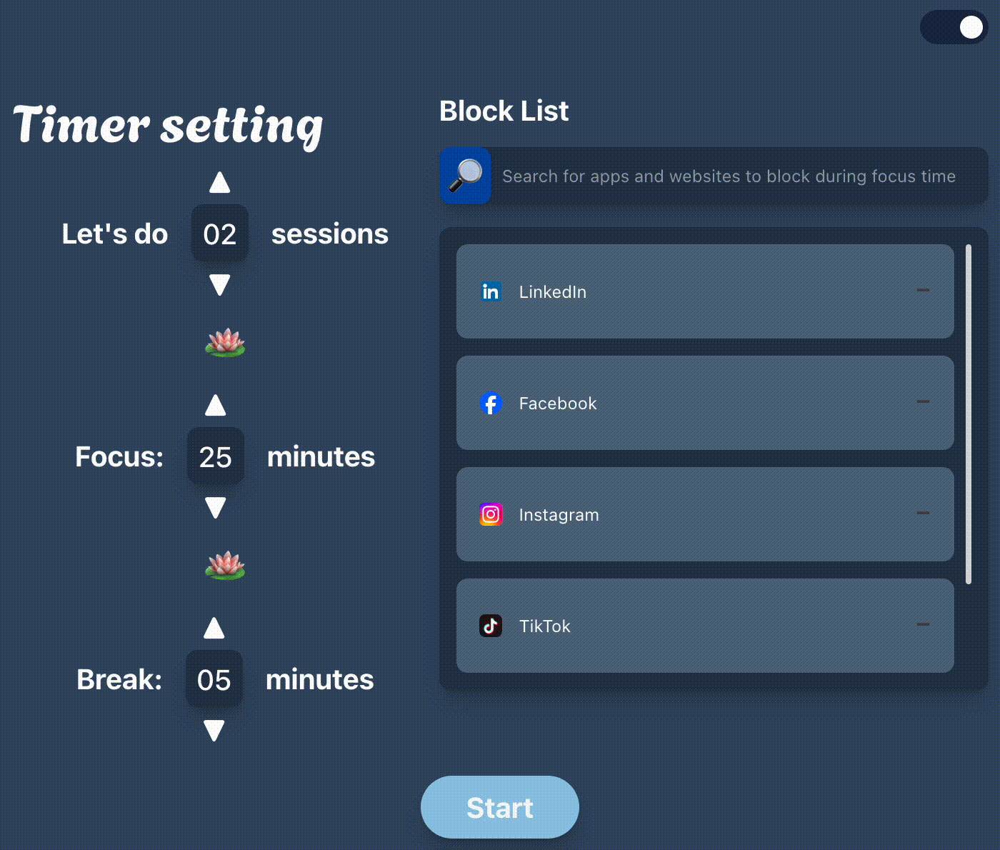
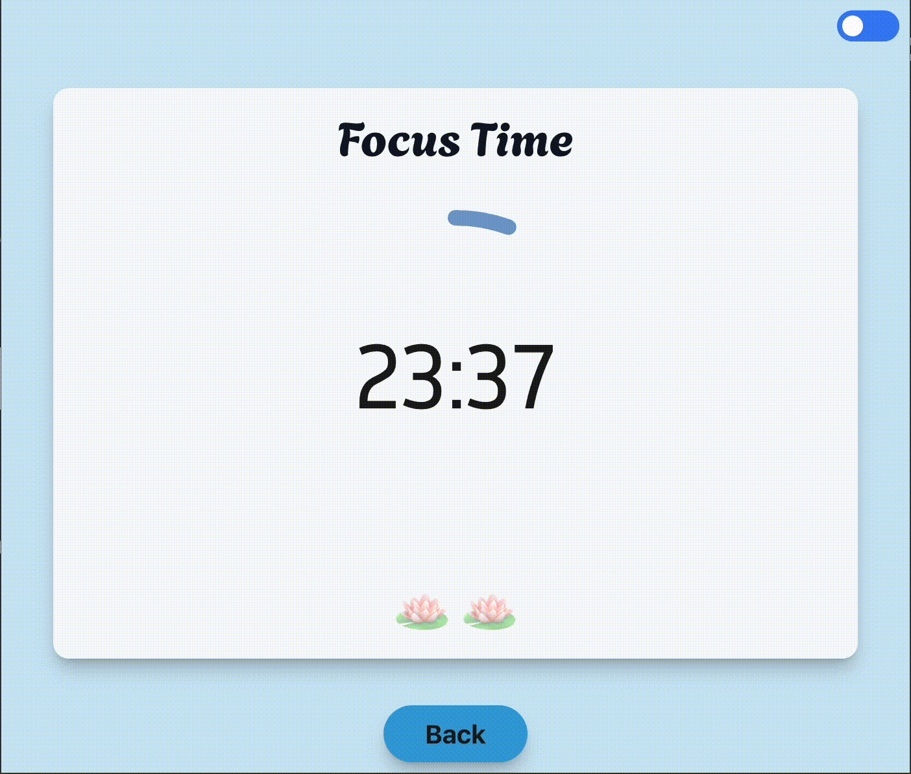

# 🪷 ZenCycle

  

## Table of Contents

- [Intro](#intro)
- [Features](#features)
- [Tech Stacks](#tech-stacks)
- [Getting started](#getting-started)
    - [Chrome](#for-chrome-)
    - [Firefox](#for-firefox-)
- [Install dependency](#install-dependency-for-turborepo)
    - [For root](#for-root-)
    - [For module](#for-module-)
- [Troubleshooting](#troubleshooting)
- [Reference](#reference)

## Intro

**🪷 ZenCycle** is a browser extension designed to help you regain focus and boost productivity by incorporating the Pomodoro technique with website-blocking feature. With customizable focus and break durations, this extension empowers you to manage distractions and stay on track with your tasks.

## Features

🪷 Customizable focus duration, break duration, and list of blocked websites and countdown timer

🪷 Dark mode and light mode

  
  

🪷 Focus mode with website-blocking feature

🪷 Push notification with sound after each focus and break

  
  

## Tech Stacks

- [React18](https://reactjs.org/)
- [TypeScript](https://www.typescriptlang.org/)
- [Tailwindcss](https://tailwindcss.com/)
- [Vite](https://vitejs.dev/) with [Rollup](https://rollupjs.org/)
- [Turborepo](https://turbo.build/repo)
- [Prettier](https://prettier.io/)
- [ESLint](https://eslint.org/)
- [Chrome Extensions Manifest Version 3](https://developer.chrome.com/docs/extensions/mv3/intro/)
- [Custom i18n package](/packages/i18n/)
- [Custom HMR (Hot Module Rebuild) plugin](/packages/hmr/)
- [End-to-end testing with WebdriverIO](https://webdriver.io/)

## Getting started

1. When you're using Windows run this:
   - `git config --global core.eol lf`
   - `git config --global core.autocrlf input`

   **This will set the EOL (End of line) character to be the same as on Linux/macOS. Without this, our bash script won't work, and you will have conflicts with developers on Linux/macOS.**
2. Clone this repository.
3. Edit `/packages/i18n/locales/`{your locale(s)}/`messages.json`
4. In the objects `extensionDescription` and `extensionName`, change the `message` fields (leave `description` alone)
5. In `/.package.json`, change the `version` to the desired version of your extension.
6. Install pnpm globally: `npm install -g pnpm` (check your node version >= 18.19.1)
7. Run `pnpm install`

Then, depending on the target browser:

### For Chrome: 

1. Run:
`nvm install stable && nvm use stable`
    - Dev: `pnpm dev` (on Windows, you should run as administrator; see [issue#456](https://github.com/ginny100/ZenCycle/issues/456))
    - Prod: `pnpm build`
2. Open in browser - `chrome://extensions`
3. Check - <kbd>Developer mode</kbd>
4. Click - <kbd>Load unpacked</kbd> in the upper left corner
5. Select the `dist` directory from the boilerplate project

### For Firefox: 

1. Run:
    - Dev: `pnpm dev:firefox`
    - Prod: `pnpm build:firefox`
2. Open in browser - `about:debugging#/runtime/this-firefox`
3. Click - <kbd>Load Temporary Add-on...</kbd> in the upper right corner
4. Select the `./dist/manifest.json` file from the boilerplate project

> [!NOTE]
> In Firefox, you load add-ons in temporary mode. That means they'll disappear after each browser close. You have to load the add-on on every browser launch.

## Install dependency for turborepo: 

### For root: 

1. Run `pnpm i <package> -w`

### For module: 

1. Run `pnpm i <package> -F <module name>`

`package` - Name of the package you want to install e.g. `nodemon` \
`module-name` - You can find it inside each `package.json` under the key `name`, e.g. `@extension/content-script`, you can use only `content-script` without `@extension/` prefix

## Troubleshooting

### Hot module reload seems to have frozen

If saving source files doesn't cause the extension HMR code to trigger a reload of the browser page, try this:

1. Ctrl+C the development server and restart it (`pnpm run dev`)
2. If you get a [`grpc` error](https://github.com/ginny100/ZenCycle/issues/612),
   [kill the `turbo` process](https://github.com/ginny100/ZenCycle/issues/612#issuecomment-2518982339) and run `pnpm dev` again.

## Reference

- [Chrome Extensions](https://developer.chrome.com/docs/extensions)
- [Vite Plugin](https://vitejs.dev/guide/api-plugin.html)
- [Rollup](https://rollupjs.org/guide/en/)
- [Turborepo](https://turbo.build/repo/docs)
- [Rollup-plugin-chrome-extension](https://www.extend-chrome.dev/rollup-plugin)
- [Chrome Extension Boilerplate](https://github.com/ginny100/ZenCycle)
